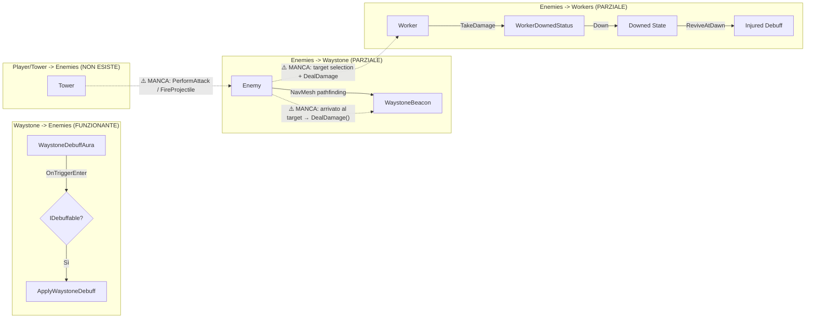

# Combat System Audit – Wilderness Survival

## Sezione 1: Trovato combat system?

**PARZIALE**

Esistono componenti funzionanti per **ricevere danno** (TakeDamage), **morire** (Die), **debuff** (IDebuffable) e **downed/injury** sui worker. Tuttavia, **non esiste ancora un sistema attivo che infligga danno** (nessun DealDamage, PerformAttack, o logica torre/proiettile).

---

## Sezione 2: Componenti trovati

### 🎯 Interfacce

| Interfaccia | Path | Descrizione |
|-------------|------|-------------|
| `IDebuffable` | [IDebuffable.cs](file:///c:/Users/riku2/Desktop/Wild/Wilderness%20-%20Copy%20-%20Copy/Assets/_Gameplay/Enemies/IDebuffable.cs) | Debuff aura: `ApplyWaystoneDebuff(moveMul, atkMul)`, `RemoveWaystoneDebuff()` |
| `IHealth` | [EnemySpawner.cs#L233](file:///c:/Users/riku2/Desktop/Wild/Wilderness%20-%20Copy%20-%20Copy/Assets/_Gameplay/Enemies/EnemySpawner.cs#L233) | `SetMaxHealth()`, `GetCurrentHealth()`, `TakeDamage()` – Non implementata su alcun componente reale |

---

### 💀 Enemies

| File | Classe/Metodo | Descrizione |
|------|---------------|-------------|
| [EnemyController.cs](file:///c:/Users/riku2/Desktop/Wild/Wilderness%20-%20Copy%20-%20Copy/Assets/_Gameplay/Enemies/EnemyController.cs) | `TakeDamage(float)` | ✅ Riduce HP, chiama `Die()` quando HP ≤ 0 |
| | `Die()` | ✅ Ferma NavMesh, calcola reward drop, `Destroy()` |
| | `IDebuffable` | ✅ Applica/rimuove debuff movimento+attacco |
| [EnemyInstance.cs](file:///c:/Users/riku2/Desktop/Wild/Wilderness%20-%20Copy%20-%20Copy/Assets/_Gameplay/Enemies/EnemySpawner.cs#L244) | `TakeDamage()`, `Die()` | ✅ Classe legacy backup con stessa logica |
| [EnemyData.cs](file:///c:/Users/riku2/Desktop/Wild/Wilderness%20-%20Copy%20-%20Copy/Assets/_Gameplay/Enemies/EnemyData.cs) | ScriptableObject | ✅ `AttackDamage`, `AttackInterval`, `AttackRange`, `AggroRange`, `TargetPriority`, `DamageType` enum con Weaknesses/Resistances |
| [EnemyDummyDebuffable.cs](file:///c:/Users/riku2/Desktop/Wild/Wilderness%20-%20Copy%20-%20Copy/Assets/_Gameplay/Enemies/EnemyDummyDebuffable.cs) | `IDebuffable` test | Test dummy per debug aura |

---

### 🏛️ Waystone/Base

| File | Classe/Metodo | Descrizione |
|------|---------------|-------------|
| [WaystoneBeaconController.cs](file:///c:/Users/riku2/Desktop/Wild/Wilderness%20-%20Copy%20-%20Copy/Assets/_Gameplay/Core/WaystoneBeaconController.cs) | `TakeDamage(int)` | ✅ Riduce HP, flash visivo, chiama `Die()` |
| | `Die()` | ✅ Game Over trigger, disabilita visuals |
| | `HandleDayRepair()` | ✅ Regen HP durante il giorno |
| [WaystoneDebuffAura.cs](file:///c:/Users/riku2/Desktop/Wild/Wilderness%20-%20Copy%20-%20Copy/Assets/_Gameplay/Structures/Waystone/WaystoneDebuffAura.cs) | `OnTriggerEnter/Exit` | ✅ Trigger-based debuff applicazione via `IDebuffable` |
| | `TickDebuffs()` | ✅ Re-applica debuff ogni tick a enemies nel raggio |

---

### 🏗️ Structures (Generic)

| File | Classe/Metodo | Descrizione |
|------|---------------|-------------|
| [StructureController.cs](file:///c:/Users/riku2/Desktop/Wild/Wilderness%20-%20Copy%20-%20Copy/Assets/_Gameplay/Structures/StructureController.cs#L753) | `TakeDamage(float)` | ✅ HP - armor reduction, stato `Damaged` a 30%, `Die()` a 0 |
| | `Repair(float)` | ✅ Ripristina HP, esce da stato Damaged |
| | `Die()` | ✅ ChangeState(Destroyed) |
| [StructureData.cs](file:///c:/Users/riku2/Desktop/Wild/Wilderness%20-%20Copy%20-%20Copy/Assets/_Gameplay/Structures/StructureData.cs) | ScriptableObject | ✅ `AttackDamage`, `AttackInterval`, `AttackRange`, `MaxHealth`, `Armor` – **dati presenti ma inutilizzati** |

---

### 👷 Workers

| File | Classe/Metodo | Descrizione |
|------|---------------|-------------|
| [WorkerInstance.cs](file:///c:/Users/riku2/Desktop/Wild/Wilderness%20-%20Copy%20-%20Copy/Assets/_Gameplay/Workers/WorkerInstance.cs#L393) | `TakeDamage(float)` | ✅ Riduce HP, chiama `OnDeath()` o `WorkerDownedStatus.Down()` |
| | `Heal(float)` | ✅ Ripristina HP |
| [WorkerDownedStatus.cs](file:///c:/Users/riku2/Desktop/Wild/Wilderness%20-%20Copy%20-%20Copy/Assets/_Gameplay/Workers/WorkerDownedStatus.cs) | `Down()` | ✅ Stato "a terra", ferma NavMesh, disabilita funzioni |
| | `ReviveAtDawn()` | ✅ Rialza al mattino + applica Injury debuff |
| | `TickDay()` | ✅ Decrementa giorni injury, rimuove quando scade |
| [WorkerData.cs](file:///c:/Users/riku2/Desktop/Wild/Wilderness%20-%20Copy%20-%20Copy/Assets/_Gameplay/Workers/WorkerData.cs) | ScriptableObject | ✅ `AttackDamage`, `AttackInterval`, `AttackRange`, `BaseHealth`, `BaseArmor` – **dati presenti ma inutilizzati** |
| [WorkerAnimatorController.cs](file:///c:/Users/riku2/Desktop/Wild/Wilderness%20-%20Copy%20-%20Copy/Assets/_Gameplay/Workers/WorkerAnimatorController.cs) | `SetAttacking(bool)` | ✅ Parametro animator `IsAttacking` pronto |

---

## Sezione 3: Flow attuale



**Situazione attuale:**
1. **Enemy → Waystone:** Nemici si muovono verso Waystone via NavMesh + `BaseCenterSystem`. **Non esiste logica di attacco attiva** – arrivano allo stopping distance ma non infliggono danno.
2. **Waystone → Enemy:** Debuff aura funziona perfettamente con trigger collision.
3. **Tower → Enemy:** **Non esiste**. `StructureData` ha campi `AttackDamage/Range/Interval` ma nessun componente li usa.
4. **Enemy → Worker:** **Non esiste**. Workers hanno `TakeDamage()` e sistema Downed/Injury, ma nessun nemico li targetizza o attacca.

---

## Sezione 4: Buchi/mancanze

| # | Mancanza | Priorità | Note |
|---|----------|----------|------|
| 1 | **`IDamageable` unificato** | 🔴 ALTA | Ogni classe ha il suo `TakeDamage()` con firme diverse (`float` vs `int`). Serve interfaccia comune. |
| 2 | **DealDamage / PerformAttack** | 🔴 ALTA | Nessun sistema infligge danno. Enemies arrivano al target ma non attaccano. |
| 3 | **Attack Cooldown** | 🟡 MEDIA | `AttackInterval` esiste nei dati ma non è implementato. |
| 4 | **Target Selection per Enemies** | 🟡 MEDIA | `EnemyData.TargetPriority` e `AggroRange` esistono ma non usati. Enemies vanno solo al Waystone. |
| 5 | **Tower Attack Logic** | 🟡 MEDIA | Strutture non attaccano. Serve componente `TowerAttack` che usi `StructureData.AttackDamage/Range/Interval`. |
| 6 | **Projectile System** | 🟢 BASSA | Nessun sistema proiettili. Per torri melee può non servire. |
| 7 | **Hit Detection** | 🟢 BASSA | Nessun raycast/overlap per melee. Potrebbe bastare distanza check. |
| 8 | **Aggro/Threat Table** | 🟢 BASSA | Non esiste. Enemies potrebbero switchare target se worker li colpisce. |

---

## Sezione 5: Proposta minima next step

> [!IMPORTANT]
> Architettura minima compatibile con codice esistente:

### 1. `IDamageable` Interface

```csharp
public interface IDamageable
{
    void TakeDamage(float damage, DamageType type = DamageType.None);
    float CurrentHealth { get; }
    float MaxHealth { get; }
    bool IsAlive { get; }
}
```

**Implementare su:** `EnemyController`, `StructureController`, `WorkerInstance`, `WaystoneBeaconController`

---

### 2. `DamageDealer` Component

```csharp
public class DamageDealer : MonoBehaviour
{
    [SerializeField] private float damage;
    [SerializeField] private float attackInterval;
    [SerializeField] private float attackRange;
    [SerializeField] private LayerMask targetLayers;

    private float cooldownTimer;

    public bool CanAttack => cooldownTimer <= 0f;

    public void PerformAttack(IDamageable target)
    {
        if (!CanAttack) return;
        target.TakeDamage(damage);
        cooldownTimer = attackInterval;
    }

    private void Update() => cooldownTimer -= Time.deltaTime;
}
```

**Attach a:** Enemy prefabs, Tower structures

---

### 3. Modifiche immediate

1. **EnemyController.Update():** Quando `distance <= attackRange && CanAttack → target.TakeDamage(CurrentDamage)`
2. **StructureController:** Aggiungere `TowerBehavior` che cerca nemici in range e attacca
3. **WaystoneBeaconController:** Implementare `IDamageable`
4. **WorkerInstance:** Implementare `IDamageable`, collegare a `WorkerDownedStatus.Down()` quando HP ≤ 0

---

### 4. Ordine di implementazione suggerito

1. ✅ **Fase 0 (già fatto):** Health/TakeDamage su tutti i target
2. 🔲 **Fase 1:** `IDamageable` interface + implementazione
3. 🔲 **Fase 2:** Enemy attack quando raggiunge target (Waystone)
4. 🔲 **Fase 3:** Tower attack verso nemici in range
5. 🔲 **Fase 4:** Enemy target selection (Worker/Structure secondari)
6. 🔲 **Fase 5:** Projectile system (opzionale)
