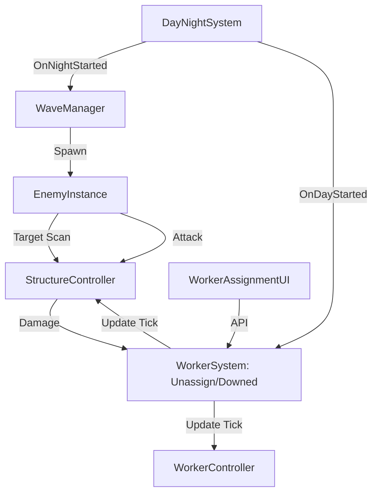

# Analisi Tecnica "As-Is" - Wilderness Survival (Mobile)

**Data:** 2025-12-19  
**Ruolo:** Lead Unity Engineer + Mobile Tech Director  

## Stato Attuale (Sintesi)
Il progetto presenta una solida base funzionale con sistemi core già implementati (Worker, Structures, Day/Night, Waves). L'architettura è prevalentemente basata su **Singleton** e **ScriptableObjects**, con una comunicazione disaccoppiata tramite un sistema di **GameEvents**. Tuttavia, si riscontrano criticità significative in termini di **scalabilità del codice** (God Classes) e **performance mobile** (allocazioni GC e complessità O(n) nei loop di Update).

---

## Mappa dei Sistemi & Core Loops

### Diagramma dei Flussi Core

*   **Source of Truth (Data):** `StructureData`, `WorkerData`, `EnemyData` (ScriptableObjects).
*   **Source of Truth (State):** `StructureController` (State), `WorkerInstance` (Job/Status), `EnemyInstance` (AI State).

---

## Audit Architetturale

| Area | Osservazioni | Rischio |
| :--- | :--- | :--- |
| **Singleton/Managers** | Uso massiccio di Singleton (`WorkerSystem`, `StructureSystem`, `CombatTelemetry`). | **Medio**: Accoppiamento rigido, difficile da unit-testare. |
| **Coupling UI ↔ Gameplay** | UI usa Singleton per accedere ai dati. `WorkerAssignmentUI` è ben isolato grazie al pooling. | **Basso**: L'isolamento è accettabile per un soft-launch. |
| **ScriptableObjects** | Ottimo uso per configurazione (`JobDatabase`, `StructureData`). Consente ai designer di iterare senza codice. | **Minimo**: Architettura standard e scalabile. |
| **Event System** | `GameEvent` (SO-based) usato per cicli Giorno/Notte. Pulito e disaccoppiato. | **Minimo**: Best practice Unity. |
| **State Management** | Stati frammentati tra Controller e Instance. Rischio di desync su distruzione strutture. | **Alto**: Necessita di cleanup rigoroso in `OnDestroy`. |

---

## Performance & Mobile

> [!WARNING]
> **Performance Bottleneck:** Molti sistemi usano `Update()` per iterare liste o fare scansioni fisiche, il che causerà thermal throttling su mobile con >20 agenti.

1.  **Allocazioni (GC):** `StructureSystem.UpdateCounts` usa LINQ (`Count(s => ...)`) ogni frame. **Critico**: Va sostituito con contatori incrementali.
2.  **Physics Overlap:** `EnemyInstance.ScanForTarget` e `StructureSystem.ValidatePlacement` usano query fisiche. La frequenza di scan dei nemici deve essere distribuita (Throttled/Staggered).
3.  **NavMesh Agent:** Ogni nemico ha un agente. Su mobile, oltre i 30-40 agenti, il costo del pathfinding e della simulazione diventa pesante.
4.  **Update Spam:** `StructureController` e `WorkerController` hanno loop di update manuali. Se le strutture crescono (>50), il costo di iterazione in C# diventa sensibile.

---

## Stabilità & Bug Risk

*   **Race Conditions:** Cambi di stato (es. `OnNightStarted`) mentre la UI di assegnazione è aperta possono portare a assegnazioni inconsistenti.
*   **Lifecycle:** `StructureController` (1.6k righe) gestisce troppe cose. Se viene distrutto durante una coroutine o un'animazione visual, c'è alto rischio di `NullReferenceException`.
*   **Warp Fuori NavMesh:** `EnemyInstance.EnsureOnNavMesh` è una patch reattiva. Meglio validare gli spawn points a monte.

---

## Scorecard (0–10)

| Categoria | Score | Commento |
| :--- | :--- | :--- |
| **Architettura** | 6/10 | Solida ma troppo dipendente da Singleton. `StructureController` è una God Class. |
| **Performance** | 5/10 | Presenti allocazioni LINQ in Update e scansioni non throttled. Rischio batteria. |
| **Stabilità** | 7/10 | Buona gestione degli stati core, ma edge case su distruzione non del tutto coperti. |
| **Scalabilità** | 5/10 | Difficile aggiungere nuovi sistemi complessi senza ingrassare i Manager esistenti. |
| **Prod-ready Mobile**| 4/10 | Richiede ottimizzazione loop, profilazione memoria e stripping di log/telemetry. |

---

## Top 10 Rischi

1.  **Memory Leak/Crashes (High/Med):** Mancanza di cleanup rigoroso in `OnDestroy` dei Controller.
2.  **Thermal Throttling (High/High):** `Update()` loops pesanti e scansioni nemici frequenti.
3.  **LINQ in Update (Med/High):** `StructureSystem.UpdateCounts` genererà stuttering costante.
4.  **Broken Worker Assignment (Med/Med):** Struttura distrutta mentre il worker è in viaggio (già riscontrato in log).
5.  **NavMesh Desync (Med/Low):** Nemici che rimangono "stuck" fuori dalla griglia navigabile.
6.  **UI Overlap (Low/High):** Più pannelli aperti contemporaneamente senza un `UIManager` centralizzato.
7.  **Telemetry Overhead (Low/Med):** Log frequenti in build di produzione appesantiscono la CPU.
8.  **Shader Complexity (High/Low):** URP Lit su troppi oggetti piccoli può abbassare il frame rate su entry-level.
9.  **Physics Matrix (Low/Med):** Layer ignorati nelle collisioni/overlap check.
10. **State Machine Bloat (Med/Med):** Logica di switch-case gigante nei Controller.

---

## Quick Wins (1 Giorno)

1.  **Eliminare LINQ da `StructureSystem.Update`**: Sostituire `allStructures.Count(...)` con variabili `int` aggiornate in `Register/Unregister`.
2.  **Throttling Enemy Scan**: Eseguire `ScanForTarget` solo ogni 0.5s - 1s invece di ogni frame, usando uno staggered timer.
3.  **Cache `Camera.main`**: In `StructureStatusUI` e altri script, non chiamare `Camera.main` in Update/LateUpdate.
4.  **Logging Define Symbols**: Avvolgere i log pesanti di telemetria in `#if UNITY_EDITOR || DEVELOPMENT_BUILD`.
5.  **Fix Worker Reset**: Assicurarsi che `UnassignWorker` resetti sempre il worker allo stato `Idle` correttamente.

---

## Roadmap 2 Settimane

### Milestone 1: Performance & Core Fix (Settimana 1)
- [ ] Refactor `UpdateCounts` e `Update` loop (rimozione LINQ/polling).
- [ ] Implementazione "Staggered Updates" per AI nemica per spalmare il carico CPU.
- [ ] Audit Layer/Physics: Setup rigido della collision matrix per mobile.
- [ ] Fix critici su distruzione strutture e lavoratori "stuck".

### Milestone 2: Architettura & Polishing (Settimana 2)
- [ ] Split di `StructureController` (separazione Visual vs Logic vs Combat).
- [ ] Implementazione Addressables (opzionale) o ottimizzazione asset loading.
- [ ] Setup centralizzato `MobileBuildSettings` (stripping, IL2CPP, Texture Compression).
- [ ] Implementazione Crash Reporting (es. Backtrace/Firebase).

---

## Checklist "Soft Launch Ready"

- [ ] **Frame Rate:** 30 FPS stabili su device medio-gamma (target minimo).
- [ ] **Battery:** <10% consumo in 15 min di sessione.
- [ ] **Crash-Free Rate:** >98% in test interni.
- [ ] **UX:** Flusso tutorial (Day 1) senza blocchi (soft-lock).
- [ ] **Analytics:** Eventi "Night Survived" e "Structure Built" tracciati.
- [ ] **Offline Guard:** Gestione della perdita di focus (OnApplicationPause).
